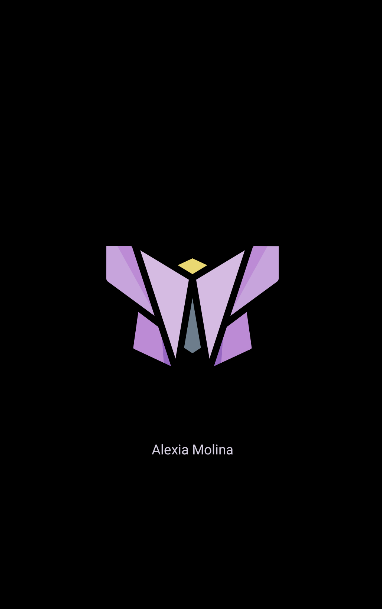

# Ari's **First** true project :)

>This is an upgrade of my proyect "Fundamentals"

## SPLASH

  * The splash is simple, the main logo blinks slowly and heads your way to the first screen, the login

  * If you turn the phone it automatically adjust

  

    

    

    Java [here :)](https://github.com/ArinoMichi/First/blob/master/app/src/main/java/com/amolina/first/Splashu.java)

    Layout [here :)](https://github.com/ArinoMichi/First/blob/master/app/src/main/res/layout/activity_splashu.xml)

## LOGIN ACTIVITY

The main features are:

  * The pfp is a link, so it's meant to be replaced with users pfps in the future

  * When you tap the "New? Sign in" text, it leads you to the next screen, the Sign in

  * You can't go back to the splash in no way

  * There is also a landscape mode :)
  
   

   
      
   Java [here :)](https://github.com/ArinoMichi/First/blob/master/app/src/main/java/com/amolina/first/LoginActivity.java)

   Layout [here :)](https://github.com/ArinoMichi/First/blob/master/app/src/main/res/layout/activity_login.xml)

 ## SIGN IN 

Features:

  * The background is, actually, a calm galaxy moving slowly, so the user wants to sign in 

  * When you press cancel it goes back to the login page

   

   Java [here :)](https://github.com/ArinoMichi/First/blob/master/app/src/main/java/com/amolina/first/SignUpActivity.java)

   Layout [here :)](https://github.com/ArinoMichi/First/blob/master/app/src/main/res/layout/activity_sign_up.xml)

 ## MAIN ACTIVITY

 >Now let's get to the main activity of this app

Features:

  * The main activity is just a image from https://thispersondoesnotexist.com that chages every time you pull the screen down ( when you do that a message saying "Hi there, I dont exist :)" shows up)

  * There are other features related to interaction with this activity:

   
   
 >When you press the little heart on top of the screen it shows:

   
   
 >This shows up when you do a long tap

   

>When you tap "Copy" it shows you this

   
   
>The three dots on the app bar show some options
>
   
   
 * Log out takes you back to the log in screen and exit app exits the app 

   Java [here :)](https://github.com/ArinoMichi/First/blob/master/app/src/main/java/com/amolina/first/Main.java)

   Layout [here :)](https://github.com/ArinoMichi/First/blob/master/app/src/main/res/layout/activity_main.xml)
   
   
  
 ### And that's it! thanks for reading and feel free to download or copy the proyect so you can see how it works yourself :)
